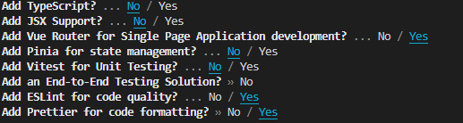
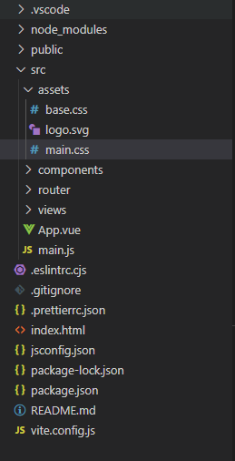
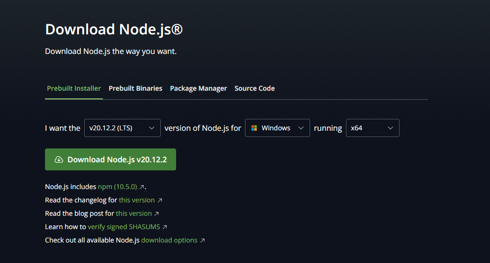

# Aula de Introdução a vueRouter e components

## requisitos do ambiente virtual
É necessário para fazer este tutorial que em sua máquina esteja intalado:

- [Visual Studio Code](https://code.visualstudio.com)
- [Extensões Recomendadas](#extensões)
- [Nodejs](https://nodejs.org/)

Caso não tenha algum destes requisitos em sua máquina, vá para a [configuração do abiente virtual](#configuração-do-ambiente-virtual) no fim desta página.

# 1-Criação do Projeto

- Crie uma pasta para o projeto
- Após criada a pasta abra-a no VS code
- Agora inicie um projeto em Vue:
  ```shell
  npm init vue@latest .
  ```
  - IMPORTANTE! Não esquedoça do ponto no final!
    - >Este ponto ao fim da linha de comando indica que o projeto será criado na pasta atual em que você está executando o comando npm init. Portanto, antes de executar o comando para iniciar um projeto em Vue, verifique se a pasta em que você deseja criar o projeto está aberta no terminal. Para confirmar, execute o comando `pwd` e será exibido o caminho da pasta atual.
  - Confirmado se o caminho está correto, após executar o comando para iniciar um projeto em VueJS, aceite as seguintes especificações:



- Execute o seguinte comando para instalar as dependêcias:
  ```shell
  npm install
  ```
- Vá para a pasta `src`, localizado na pasta assets e exclua todo o conteúdo do arquivo `main.css`.



- Exclua todos os arquivos dentro de `components` e também o arquivo `AboutView.vue`, localizado na pasta `views`.
- Também exclua o seguinte código do arquivo `index.js`, que está situado dentro da pasta `router`.

```js
{
      path: '/about',
      name: 'about',
      // route level code-splitting
      // this generates a separate chunk (About.[hash].js) for this route
      // which is lazy-loaded when the route is visited.
      component: () => import('../views/AboutView.vue')
    }
```
#### O novo conteúdo do arquivo `index.js` deverá ser apenas o apresentado abaixo:

```js
import { createRouter, createWebHistory } from 'vue-router'
import HomeView from '../views/HomeView.vue'

const router = createRouter({
  history: createWebHistory(import.meta.env.BASE_URL),
  routes: [
    {
      path: '/',
      name: 'home',
      component: HomeView
    },
  ]
})

export default router
```

#### Exclua também o conteúdo do arquivo `App.vue`, preservando apenas o conteúdo abaixo:
```html
<script setup>

</script>

<template>
 
</template>

<style scoped>

</style>
```

Faça o mesmo com o arquivo `HomeView.vue`, que está situado na pasta `views`.

Agora, após todas as alterações, execute o seguinte comando no terminal para executar o projeto, que ficará disponível para acesso em uma porta local:

```shell
npm run dev
```

**IMPORTANTE! A partir de agora abra outro terminal e mantenha este rodando para ver o andamento da aplicação.**

## <u>Pronto! Seu projeto foi criado!!</u>

# 2-Components

Um `component` é como o nome sugere, ser um componente de uma página. O grande diferencial de um `component` do `Vue` para uma `div` qualquer é o armazenamento de script, CSS e reusabilidade.

Por exemplo, um botão que se repete diversas vezes em diversas páginas você normalmente teria que recriar o botão em todas as páginas com o CSS e script, porém com o `Vue` você cria este botão apenas uma vez e apenas o importa para as páginas que deseja reutiliar.

Para ver isso na prática criaremos dois `components`, um menu de navegação e um formulário.

- Crie um arquivo chamado `MenuNav.vue` na pasta `components`.
- Deixe-o com o mesmo conteúdo do arquivo `App.vue`.
- Agora crie um `header` a seu gosto na pasta `template`.
- Estilize-o como desejar.
- Agora, dentro do arquivo `App.vue` importe o `component`.
  ```html
  <script setup>
    import MenuNav from './components/MenuNav.vue'
  </script>
  ```
- Agora adicione-o ao `App.vue`: 
    ```html
    <template>
        <header>
            <MenuNav />
        </header>
    </template>
    ``` 
Perceba que agora o menu é exibido, mesmo não tendo sido criado no `App.vue`. É desta maneira para todos os components que desejar adicionar, basta importa-los e alocar no `template`. Lembrando que esta prática é ainda mais valiosa quando se trata de um `component` que será reutilizado em diversas páginas.

Agora para fazer o formulário crie o arquivo `FormUser.vue` na pasta `components`, e adicione o código abaixo:

```html
<template>
    <form>
        <label for="nome">nome</label>
        <input type="text" name="nome">
        <label for="email">email</label>
        <input type="email" name="email">
        <label for="idade">idade</label>
        <input type="number" name="idade">
    </form>
</template>

<style>
form {
    display: flex;
    flex-direction: column;
}
input {
    max-width: 15%;
}
</style>
```

Agora, importe-o para `HomeView.vue`, usando o seguinte código:

```html
<script setup>
import FormUser from '../components/FormUser.vue';
</script>
```
- E aplique-o dentro da View:

```html
<template>
  <main>
    <h1>Página inicial</h1>
    <FormUser />
  </main>
</template>
```

Perceba que o formulário ainda não é exibido. Tudo bem, pois faremos uma implementação correspondente na sequência.

# 3-VueRouter

VueRouter é o recurso que possibilita o desenvolvimento de uma aplicação com navegação no Vue. Para isso utilizaremos as `views`, que são diferentes telas de visualização.

Um exemplo sobre a navegação é a `HomeView.vue`, que já foi utilizada anteriormente.

Agora criaremos outra `view` e apresentaremos as `views` para o usuário.

- Para exibir a `view` que já existe, utilizaremos o `RouterView`. Importaremos o recurso no `App.vue`, usando o seguinte código:
```html
<script setup>
import { RouterView } from 'vue-router'
...
</script>
```

Agora vamos apresentar a view para o usuário, da mesma maneira que fizemos com o `component` no `App.vue`:
```html
<template>
    ...
 <RouterView />
</template>
```

Perceba que agora o Formulário é exibido. Isso acontece porque o alocamos na view `HomeView.vue`, que antes não era exibidi. Agora, com o `RouterView`, a view é exibida.

Agora criaremos uma segunda `view` para que possamos navegar entre as `views`.


Crie outro um arquivo chamado `PicanhaView.vue` dentro da pasta `views` e adicione o seguinte código:
```html
<template>
    <h1>PICANHA</h1>
    <h2>preços</h2>
    <ul>
        <li>20</li>
        <li>50</li>
        <li>30</li>
        <li>70</li>
    </ul>
</template>
```

Agora importe o `component` que foi criado e o aloque na `FormUser`, da mesma maneira que fizemos anteriormente na `Home`.

Assim será permitido que o usuário navegue entre as `views` que foram criadas.

Para isso vamos utilizar o `RouterLink` e o component `MenuNav`, que foi criado anteriormente.

Antes disso vá em `index.js` na pasta router e adicione o seguinte código ao código já existente no arquivo referido:
```js
routes: [
    ...
    {
      path: '/picanha',
      name: 'picanha',
      component: () => import('../views/PicanhaView.vue')
    }
  ]
```

Aqui estamos definindo que a url `http://localhost:5173/picanha` exibirá a `view` `PicanhaView.vue`.

Agora importe o `RouterLink` no component `MenuNav.vue`:
```html
<script setup>
import { RouterLink } from 'vue-router'
</script>
```

Aloque-os da seguinte maneira:
```html
<template>
    <RouterLink to="/">home</RouterLink>
    <RouterLink to="/picanha">picanha</RouterLink>    
</template>
```

Aqui o `RouterLink` funciona semelhante a uma tag `<a>`. Desta maneira dizemos que o `home` corresponde com a URLa `http://localhost:5173/` e picanha corresponde com a URL `http://localhost:5173/picanha`. Ao clicar, o usuário poderá navegar entre as `views`.

Assim concluímos este tutorial. Qualquer contribuição/sugestão é bem vinda.
 
# Configuração do Ambiente

A configuração só precisa ser feita uma vez em cada computador.

## instalação do VSCode
Para instalar o VSCode, siga os seguintes passos:

**No Ubuntu/Mint e derivados:**

Digite o seguinte código no terminal do linux:

```shell
sudo apt install code
```

**No Manjaro:**

Digite o seguinte código no terminal do linux:

```shell
yay -Syu visual-studio-code-bin
```

**No Windows:**

1. Acesse o site do [VSCode](https://code.visualstudio.com);
2. Clique em "Dowload para Windows" ou "Dowload for Windows" dependendo do navegador;
3. Após executar o arquivo de instalação, seguir os passos para instalação e aceitar as condições apresentadas, seu VSCode estará pronto para uso.

## Extensões
As extensões recomendadas para o uso do VueJS são:

- [Volar](https://marketplace.visualstudio.com/items?itemName=Vue.volar)
- [ESLint](https://marketplace.visualstudio.com/items?itemName=dbaeumer.vscode-eslint)
- [Prettier](https://marketplace.visualstudio.com/items?itemName=esbenp.prettier-vscode)
- [Portuguese (Brazil) Language Pack](https://marketplace.visualstudio.com/items?itemName=MS-CEINTL.vscode-language-pack-pt-BR)
- [Code Spell Checker](https://marketplace.visualstudio.com/items?itemName=code-spell-checker.code-spell-checker)
- [Brazilian Portuguese - Code Spell Checker](https://marketplace.visualstudio.com/items?itemName=streetsidesoftware.code-spell-checker-portuguese-brazilian)
- [vscode-icons](https://marketplace.visualstudio.com/items?itemName=vscode-icons)

Para instalar as extensões, basta pesquisá-las na aba de extensões do VSCode ou clicar nos links dispostos acima e proceder com a instalação.

## Instalação ou atualização do NodeJS

O [VueJS](https://vuejs.org) é um framework de [NodeJS](https://nodejs.org/), portanto necessita que ele esteja instalado e atualizado.

Para intalar ou atualizar:

**No Linux**

Recomenda-se utilizar o `nvm`, que é o gerenciador de versões do NodeJS, desenvolvido para ser instalado utilizando a conta de um usuário final.

Para instalar ou atualizar o `nvm`, execute o seguinte código no terminal (independe do Sistema Operacional utilizado):

```shell
curl -o- https://raw.githubusercontent.com/nvm-sh/nvm/v0.39.2/install.sh | bash
```

Após isso feche o terminal, abra um novo e instale a versão LTS do NodeJS:

```shell
nvm install --lts
```

Agora o NodeJS estará instalado e atulizado, pronto para o uso.

**No Windows/Mac**

Para instalar o NodeJS no Windows, acesse o site do [NodeJS](https://nodejs.org/en) e siga estes passos:

1. Vá para a aba de Download;
2. Altere a versão que deseja instalar para LTS, e selecione as configuraçõe da máquina como na imagem:
   
3. Após o download do arquivo de instalação, executeo, siga os passos para a instalação e, aceitando as condições apresentadas, o NodeJS estará instalado e pronto para uso.